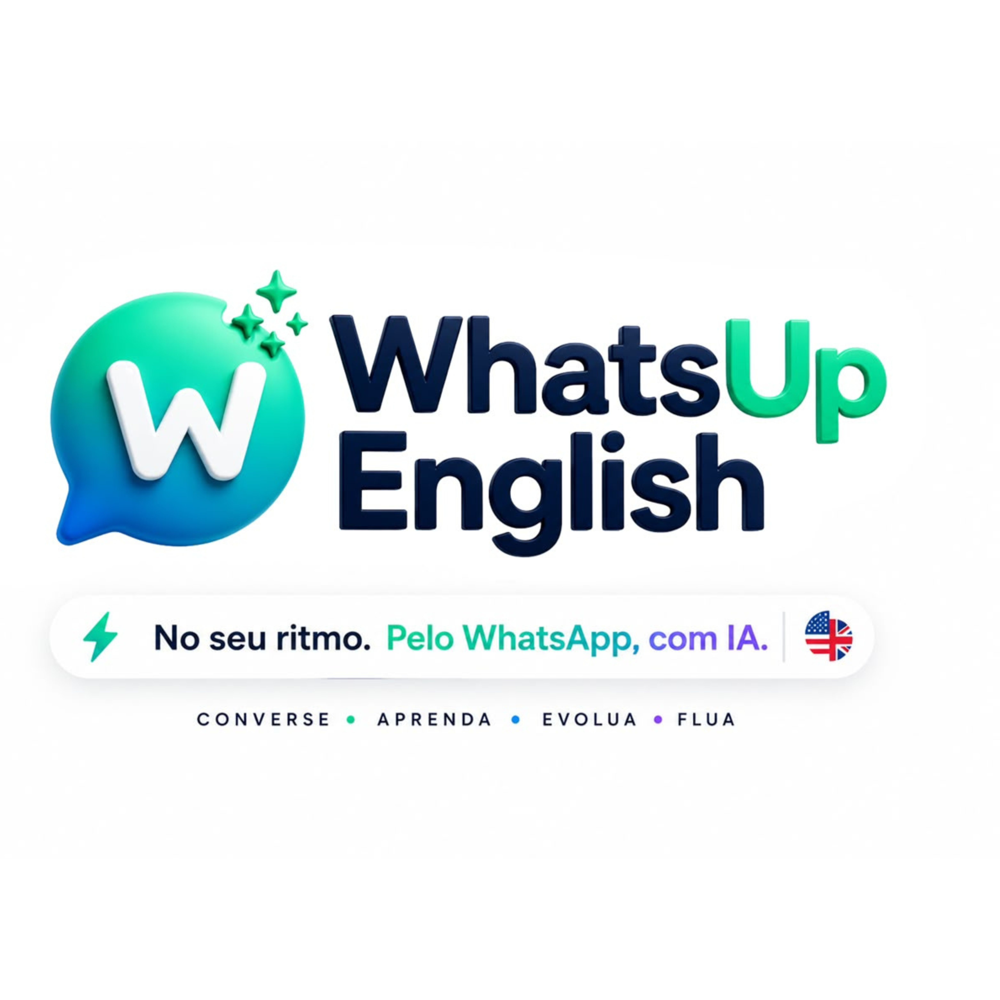
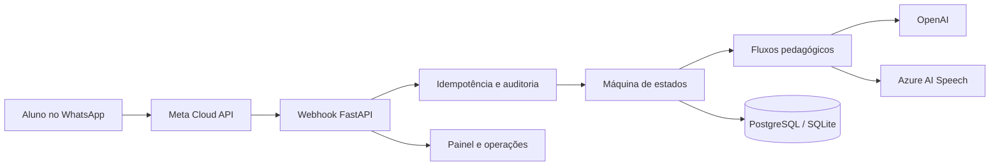

<div align="center">
  

  # WINGO | WhatsUp English

  **Inglês no seu ritmo. Pelo WhatsApp, com IA.**

  Professor virtual de inglês com aulas curtas, prática por texto e áudio,
  correção imediata e acompanhamento de progresso.

  
  
  
  
</div>

## Sobre o produto

O **WINGO** transforma o WhatsApp em uma experiência diária e personalizada de aprendizagem de inglês. Em vez de funcionar como um chatbot aberto, ele conduz o aluno por uma jornada pedagógica estruturada, com onboarding, avaliação de nível, aulas, escrita, quizzes e prática de pronúncia.

> **10 minutos de inglês por dia no WhatsApp.**

O projeto está em fase beta e já reúne a experiência conversacional, o painel visual do aluno/professor, a página comercial e a base operacional necessária para testes com usuários reais.

## O que já funciona

- Onboarding e avaliação inicial de nível.
- Currículo progressivo com 70 aulas estruturadas.
- Aulas guiadas e personalizadas por nível, objetivo e interesses.
- Exercícios de escrita, quizzes e correção com IA.
- Prática por áudio com transcrição.
- Avaliação acústica de pronúncia com Azure AI Speech.
- Memória pedagógica e histórico de aprendizagem por aluno.
- Agenda de aulas e automações acadêmicas.
- Relatório semanal e acompanhamento de progresso.
- Painel responsivo para aluno e professor em `/dashboard`.
- Página de vendas responsiva em `/`.
- Autenticação com JWT e acesso administrativo protegido.
- Saúde, métricas e auditoria operacional.

## Confiabilidade do webhook

O webhook da Meta foi projetado para evitar perda de estado e respostas duplicadas:

- Máquina de estados com transições explícitas.
- Idempotência de entrada por `message_id`.
- Chave independente para cada mensagem de saída.
- Retentativas controladas para Meta e OpenAI.
- Snapshot e restauração do estado quando a entrega falha.
- Retomada de mensagens com falha sem excluir o aluno.
- Auditoria das decisões e transições.
- Métricas de volume, erros, latência, tentativas, tokens e custo estimado.

## Arquitetura



Os fluxos conversacionais ficam separados por responsabilidade:

```text
wingo/flows/
├── onboarding.py
├── assessment.py
├── lesson.py
├── writing.py
├── quiz.py
├── bot.py
└── router.py
```

## Tecnologias

- Python 3.11+
- FastAPI e Uvicorn
- SQLAlchemy
- PostgreSQL em produção e SQLite no desenvolvimento
- OpenAI API
- Azure AI Speech
- WhatsApp Cloud API (Meta)
- JWT e bcrypt
- HTML, CSS e JavaScript
- Render

## Executando localmente

### 1. Clone o repositório

```bash
git clone git@github.com:ronanvictorr-ops/whatsup-english-api.git
cd whatsup-english-api
```

### 2. Crie e ative o ambiente virtual

```bash
python -m venv venv
```

Windows:

```powershell
.\venv\Scripts\Activate.ps1
```

Linux ou macOS:

```bash
source venv/bin/activate
```

### 3. Instale as dependências

```bash
pip install -r requirements.txt
pip install -r requirements-dev.txt
```

### 4. Configure o ambiente

Crie um arquivo `.env` na raiz. Use apenas as variáveis necessárias para o ambiente em que estiver trabalhando:

```env
DATABASE_URL=sqlite:///./whatsup.db
SECRET_KEY=troque-por-uma-chave-longa-e-aleatoria

OPENAI_API_KEY=
OPENAI_TTS_MODEL=gpt-4o-mini-tts
OPENAI_TTS_VOICE=alloy
OPENAI_TRANSCRIBE_MODEL=whisper-1

AZURE_SPEECH_KEY=
AZURE_SPEECH_REGION=brazilsouth

META_PHONE_NUMBER_ID=
META_ACCESS_TOKEN=
META_VERIFY_TOKEN=

DASHBOARD_ADMIN_TOKEN=
LOCAL_TIMEZONE=America/Sao_Paulo
LOCAL_UTC_OFFSET_HOURS=-3
ACADEMIC_AUTOMATIONS_ENABLED=true
```

Nunca envie o `.env`, tokens ou chaves de API para o GitHub.

### 5. Inicie a aplicação

```bash
uvicorn main:app --reload
```

Principais endereços locais:

| Recurso | URL |
|---|---|
| Página de vendas | `http://127.0.0.1:8000/` |
| Painel | `http://127.0.0.1:8000/dashboard` |
| Swagger | `http://127.0.0.1:8000/docs` |
| Saúde operacional | `http://127.0.0.1:8000/ops/health` |

## Configurando o WhatsApp

No painel da Meta, configure o webhook com a URL pública da aplicação:

```text
https://SEU-DOMINIO/meta-webhook
```

Use em `META_VERIFY_TOKEN` o mesmo token informado na configuração da Meta e inscreva o campo `messages`. Durante o desenvolvimento, a aplicação local precisa ser exposta por um túnel HTTPS.

## Avaliação de pronúncia

Com `AZURE_SPEECH_KEY` e `AZURE_SPEECH_REGION` configurados, o WINGO utiliza o Azure AI Speech para calcular notas acústicas de precisão, fluência, completude e prosódia, além de identificar palavras e fonemas que precisam de atenção.

Sem essas credenciais, o áudio ainda pode ser transcrito, mas o sistema informa que a avaliação acústica não está disponível. Ele não cria pontuações fictícias.

## Testes

A suíte cobre as transições de estado, os fluxos pedagógicos, idempotência, retentativas, recuperação do webhook, painel e avaliação de pronúncia.

```bash
python -m unittest discover -s tests -v
```

Estado atual: **42 testes aprovados**.

## Endpoints principais

| Área | Endpoints |
|---|---|
| Autenticação | `POST /register`, `POST /login`, `GET /me` |
| Aprendizagem | `POST /chat`, `POST /assessment`, `POST /quiz` |
| Progresso | `GET /progress`, `GET /ranking`, `GET /students/{id}/learning-records` |
| Agenda | `GET/POST /students/{id}/lesson-schedule` |
| Painel | `GET /dashboard/api/student`, `GET /dashboard/api/teacher` |
| Operações | `GET /ops/health`, `GET /ops/metrics`, `GET /ops/state-transitions` |
| WhatsApp | `GET/POST /meta-webhook` |

A especificação completa e interativa está disponível em `/docs` durante a execução.

## Estrutura do projeto

```text
whatsup-english-api/
├── dashboard/              # Painel do aluno e professor
├── sales/                  # Página comercial
├── tests/                  # Testes automatizados
├── wingo/
│   ├── flows/              # Fluxos da jornada pedagógica
│   ├── idempotency.py      # Garantias de entrada e saída
│   ├── observability.py    # Eventos e métricas
│   ├── pronunciation.py    # Integração acústica com Azure
│   ├── retries.py          # Retentativas de serviços externos
│   └── states.py           # Máquina de estados
├── database.py
├── main.py
├── models.py
├── pedagogy.py
├── PRODUCT.md
└── requirements.txt
```

## Deploy no Render

Crie um **Web Service** usando:

Build command:

```bash
pip install -r requirements.txt
```

Start command:

```bash
uvicorn main:app --host 0.0.0.0 --port $PORT
```

Em produção, configure `DATABASE_URL` com PostgreSQL e cadastre as demais variáveis no painel do Render. Não armazene segredos no repositório.

## Próximos passos

- Validar a avaliação de pronúncia com áudios reais e diferentes sotaques.
- Medir retenção diária e conclusão de aulas no beta.
- Implementar revisão espaçada automática.
- Adicionar sistema de pagamento e assinatura.
- Reforçar segurança de produção e verificação da assinatura do webhook.
- Estruturar suporte humano e operação do beta.

O planejamento comercial e pedagógico detalhado está em [`PRODUCT.md`](PRODUCT.md).

## Autor

Desenvolvido por **Ronan Victor Cunha Santos**.

Projeto em desenvolvimento para validação beta da plataforma WhatsUp English.
